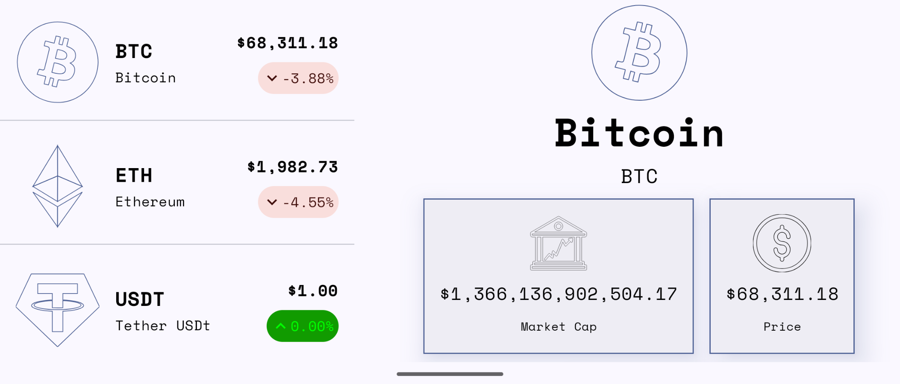

# Crypto Tracker💲



Android crypto tracking app built using Jetpack Compose.

The app displays real-time cryptocurrency prices using the CoinCap API, with a list-detail layout showing market data for various cryptocurrencies.

## Running the App

Clone the repo:

```
git clone https://github.com/philipplackner/CryptoTracker.git
cd CryptoTracker
```

Open the project in Android Studio and run it on an emulator or device.

## How the App Works

The app follows the MVVM architecture pattern:

- **MainActivity**  
  Entry point that sets up the Compose UI and initializes the ViewModel.

- **CryptoTrackerApp**  
  Root composable that handles navigation between the coin list and detail screens.

- **CoinListScreen**  
  Displays a list of cryptocurrencies with their current prices and 24-hour changes.

- **CoinDetailScreen**  
  Shows detailed information about a selected cryptocurrency including market cap, volume, and price history.

- **CryptoViewModel**  
  Manages UI state, handles API calls, and coordinates data flow using Kotlin Coroutines and Flow.

- **Repository**  
  Single source of truth for data operations, fetching data from the CoinCap API.

## Tech Stack

- **Jetpack Compose** – Modern declarative UI toolkit
- **Retrofit** – HTTP client for API calls
- **Kotlin Coroutines & Flow** – Asynchronous programming and reactive state
- **Material Design 3** – UI components and theming
- **MVVM Architecture** – Separation of concerns

## Resources

This app was built based on a free course by [Philipp Lackner](https://www.youtube.com/PhilippLackner), with code available [here](https://github.com/philipplackner/CryptoTracker).

Additional resources used:

- [CoinCap API](https://docs.coincap.io/) – Cryptocurrency market data
- [Material3 theme generator](https://material-foundation.github.io/material-theme-builder/) – Theme customization
- [Jetpack Compose crash course](https://www.youtube.com/watch?v=6_wK_Ud8--0)
- [Generic result wrapper](https://www.youtube.com/watch?v=MiLN2vs2Oe0)
- [Coroutine cancellation and exception handling](https://www.youtube.com/watch?v=VWlwkqmTLHc)
- [Initial data loading](https://www.youtube.com/watch?v=mNKQ9dc1knI)
- [One time events in channels and shared flows](https://www.youtube.com/watch?v=njchj9d_Lf8)
- [List-detail layout](https://www.youtube.com/watch?v=W3R_ETKMj0E)
